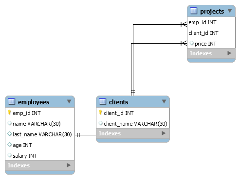

# Projects

This repository contains all of my MySQL projects.

* MySQLProject- a MySQL excercise including a sample text interface. It has two subcommands:
	* server_level - function that connects to localhost and creates a database with a specified name
	* database_interface - function that connects to database and runs the interface in terminal
Commands:
```.bash
python MySQLProject.py server_level --db_name [DATABASE_NAME]
python MySQLProject.py database_interface --db_name [DATABASE_NAME]
```
In case of server_level the DATABASE_NAME is the name of the database you want to create. In case of database_interface it's the name of the database you connect to.
##### Fig 1: Project 1 ER diagram:
