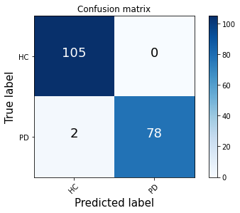

# Parkinson-AI

The aim of this project was to create a deep learning classifier capable of diagnosing Parkinson's disease based on an audio recording of the patient. 

### Files and folders:
1. Folders:
    * csvs - Directory containing csv files with extracted features for each fearture set for both split and whole files
    * full_model_testing - Directory containing both csv files with training parameters and exported models for each fold trained with the newest model version
    * layer_test_train_outputs - Directory with csv files containing training parameters of multiple tested deep layer architectures
    * Test sripts - Directory containing test script, not used in final project
    * train_outputs - Directory containing csv files with training parameters for the first model version

2. Files:
    * basic_model - First version of the model, without KFold and not utilising the best architecture
    * data_praeparation - Functions and script used to split samples and extract features
    * model_v1 - Second version model, uses KFold but not the best architecture
    * model_full - Latest version of the model
    * model-Layers-Testing - model version used to test deep layer architectures
    * visualize_results - file containing training parameter visualization and model comparison

### Data processing

The data was taken from [Mobile Device Voice Recordings at King's College London (MDVR-KCL) from both early and advanced Parkinson's disease patients and healthy controls](https://zenodo.org/record/2867216#.X9tqP9hKg2w). The samples were wav files, each about 2 minutes long. More information on the samples can be found on the site with the dataset. Other researchers working on Parkinson's disease diagnosis based on a voice recording use shorter samples, usually about 10 - 30 seconds long. Since samples shorter than the ones included in the dataset can be used for the task, each sample was split into 5 even sub-samples, which helped prevent overfitting and increased model accuracy.

Then I used the Opensmile library to extract functional features from the sub-samples. I used 3 feature sets: GeMAPS, eGeMAPS and ComParE_2016. After extraction we've assigned classes to the subsamples (0 for healthy control (HC) and 1 for Parkinson's disease (PD)). The extarcted features were then saved to csv files, which were used to load in data into the model. I also created csvs containing joined features from multiple feature sets. eGeMAPS set included all GeMAPS features, so there is no sense in joining these 2 sets.

### Model creation and learning

The first version of the model was based on [this TensorFlow tutorial](https://www.tensorflow.org/tutorials/structured_data/feature_columns). It was then adjusted to my data. The model was put in a function, so it could be easily run multiple times. I also added KFold cross-validation. The model was then trained on each feature set. The ComParE feature set was the largest, and it was processed by the normalization layers very slowly. eGeMAPS yielded better results than GeMAPS. Taking these facts into consideration I decided that eGeMAPS was the best feature set for this project. Then I tested multiple deep layer architectures:
* ID1: in > x > out
* ID2: in > x > x > out
* ID3: in > x > x/2 > out
* ID4: in > x > x > x > out
* ID5: in > x > x > x/2 > out
* ID6: in > x > x/2 > x/2 > out
* ID7: in > x > x/2 > x/4 > out
where x was 32, 64 or 128 (three values of x tested for each architecture). Architecture ID2 with 128 as x achieved the best mean validation accuracy for all folds, so it was chosen as the final architecture. After finding the best architecture I added in callbacks to save models and implemented confusion matrix (Fig 1) and classification report (Fig 2).
##### Fig 1: Confusion matrix:

##### Fig 2: Classification report:

Minimum viable product for this project was to achieve 90% accuracy, and as can be seen on figures above, it was achieved, so the project was concluded.
